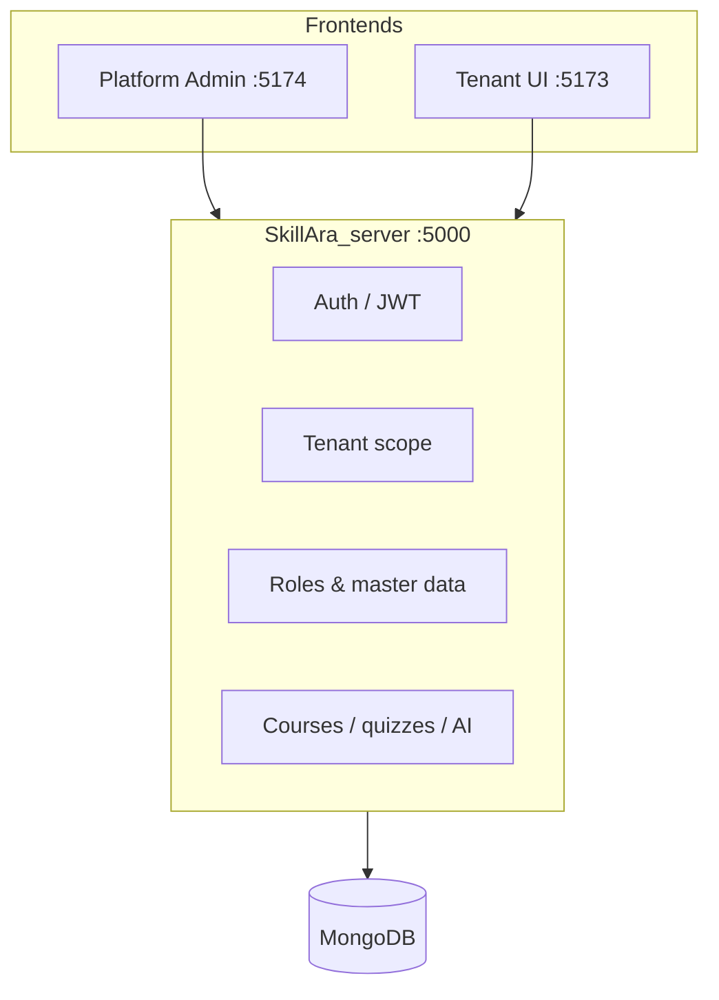

# SkillAra

**Multi-tenant SaaS learning platform** — isolated workspaces per organization, AI-assisted learning, and full RBAC from platform down to tenant level.

Built as a **distributed monorepo**: one API backend and two React frontends (platform admin + tenant workspace). This repository is the **project hub** — vision, architecture, and links to the implementation repos.

---

## Platform vision

SkillAra targets **training institutes, coaching centers, bootcamps, and corporate L&D teams** that need their own branded learning space without running separate infrastructure.

| Goal | How SkillAra addresses it |
|------|---------------------------|
| **Tenant isolation** | Each org gets `{subdomain}.skillara.com` with scoped data and auth |
| **Self-service onboarding** | Super admin provisions orgs via a guided wizard (plan, branding, owner) |
| **Flexible org structure** | Embedded roles, departments, and designations — no hardcoded dropdowns |
| **Learning delivery** | Courses, modules, lessons, quizzes, assignments, progress tracking |
| **AI augmentation** | Optional AI tutor, quiz generation, and content summarization (plan-limited) |
| **Governance** | Platform-level plans & org types; tenant-level RBAC; ownership transfer flow |

### Product surfaces

```
┌─────────────────────────────────────────────────────────────────────┐
│                         skillara.com                                 │
├─────────────────────┬───────────────────────┬─────────────────────────┤
│  Platform Admin     │  Tenant Workspace      │  API                    │
│  admin.skillara.com │  {org}.skillara.com    │  api.skillara.com       │
│  Super admin        │  Students + /admin     │  Express + MongoDB      │
└─────────────────────┴───────────────────────┴─────────────────────────┘
```

---

## Repositories

Implementation is split across dedicated GitHub repos. Clone and run each according to its README.

| Repository | Role | Stack | Link |
|------------|------|-------|------|
| **SkillAra** *(this repo)* | Project overview, architecture, resume hub | Markdown | [github.com/Varshini1812/SkillAra](https://github.com/Varshini1812/SkillAra) |
| **SkillAra_server** | REST API, auth, multi-tenancy, business logic | Node.js, Express 5, MongoDB | [github.com/Varshini1812/SkillAra_server](https://github.com/Varshini1812/SkillAra_server) |
| **SkillAra_adminpanel** | Platform super-admin UI (orgs, plans, org types) | React 19, Vite, Tailwind 4 | [github.com/Varshini1812/SkillAra_adminpanel](https://github.com/Varshini1812/SkillAra_adminpanel) |
| **SkillAra_tenantUI** | Tenant workspace — students + organization admin (`/admin`) | React 19, Vite, Tailwind 4 | [github.com/Varshini1812/SkillAra_tenantUI](https://github.com/Varshini1812/SkillAra_tenantUI) |

> **Note:** Local development folders may be named `SkillAra_client` (tenant UI) and `SkillAra_adminpanel` — they map to **SkillAra_tenantUI** and **SkillAra_adminpanel** on GitHub respectively.

---

## Architecture (high level)



### Design decisions (resume highlights)

- **Embedded tenant catalogs** — roles, departments, and designations live on the `Tenant` document; users reference stable `roleId` / `departmentId` instead of legacy string fields.
- **Platform catalogs on SuperAdmin** — subscription plans and organization types are embedded arrays, not orphan collections.
- **RS256 JWT + httpOnly refresh** — short-lived access tokens in memory; refresh rotation via cookie.
- **Subdomain tenancy** — `{tenant}.localhost` in dev; wildcard DNS in production.
- **API-first UI** — all master-data and role dropdowns load from backend; zero hardcoded option lists in admin screens.
- **Automatic tenant seeding** — new organizations get default roles, departments, and designations on creation.

---

## Tech stack

| Layer | Technologies |
|-------|----------------|
| **API** | Node.js, Express 5, Mongoose, Zod, Winston, Jest |
| **Database** | MongoDB (Atlas or local) |
| **Auth** | RS256 JWT, refresh cookies, bcrypt, optional super-admin MFA |
| **Frontends** | React 19, React Router 7, Vite 8, Tailwind CSS 4, Axios |
| **AI** | OpenAI API (tutor, quiz, summarize — usage capped by plan) |
| **Email** | Nodemailer (owner welcome / temp password) |

---

## Feature scope (current)

### Platform (super admin)

- Create / edit / suspend organizations (6-step wizard)
- Organization types & subscription plans (master data)
- Platform roles & permissions
- Ownership transfer approvals

### Organization (tenant admin — `/admin` on tenant UI)

- User management (CRUD, CSV import, department/designation assignment)
- Custom roles & permission matrix
- Master data: departments, designations
- Owner profile & ownership delegation

### Learning (tenant UI)

- Workspace discovery & tenant-scoped login
- Course catalog, enrollment, lesson player, progress
- Quizzes, assignments (API ready; UI evolving)

### Backend services

- Plan limits middleware, audit logs, integration tests
- AI endpoints with per-tenant usage tracking

---

## Roadmap

| Phase | Focus |
|-------|--------|
| **Now** | Stable multi-tenant auth, RBAC, master data, org provisioning |
| **Next** | Billing integration, email invites, richer course authoring UI |
| **Later** | Mobile-friendly learner app, analytics dashboard, marketplace |

---

## Local development (all repos)

1. Clone **SkillAra_server**, **SkillAra_adminpanel**, and **SkillAra_tenantUI** (or use this monorepo layout locally).
2. Start API: `cd SkillAra_server && npm install && cp .env.example .env && npm run dev`
3. Start platform admin: `cd SkillAra_adminpanel && npm install && npm run dev` → `http://localhost:5174`
4. Start tenant UI: `cd SkillAra_client && npm install && npm run dev` → `http://localhost:5173`
5. Create an organization from platform admin, then log in at `http://{subdomain}.localhost:5173/admin`

Detailed setup: see each repository’s README and [docs/DEVELOPMENT.md](./docs/DEVELOPMENT.md).

---

## Why changes may not show on GitHub

If you pushed code but **SkillAra_tenantUI** did not update, common causes:

1. **Wrong remote** — tenant UI code must push to `SkillAra_tenantUI`, not the umbrella `SkillAra` repo.
2. **Wrong folder** — `SkillAra_client` locally → remote **SkillAra_tenantUI**; `SkillAra_adminpanel` → **SkillAra_adminpanel**.
3. **Uncommitted files** — run `git status` and commit before push.
4. **Wrong branch** — push to `main` (or the branch GitHub displays as default).

```bash
# Example: push tenant UI (from your client folder)
cd SkillAra_client
git remote -v                    # should point to SkillAra_tenantUI
git add .
git commit -m "Your message"
git push -u origin main
```

This **SkillAra** repo intentionally holds **documentation only** — link it on your resume; point recruiters to the three implementation repos for code review.

---

## Author

**Varshini** — Full-stack developer  
GitHub: [@Varshini1812](https://github.com/Varshini1812)

*SkillAra — multi-tenant learning infrastructure with tenant-scoped RBAC and AI-ready course delivery.*

---

## License

Documentation: MIT or your choice.  
Application code: see license in each implementation repository.
